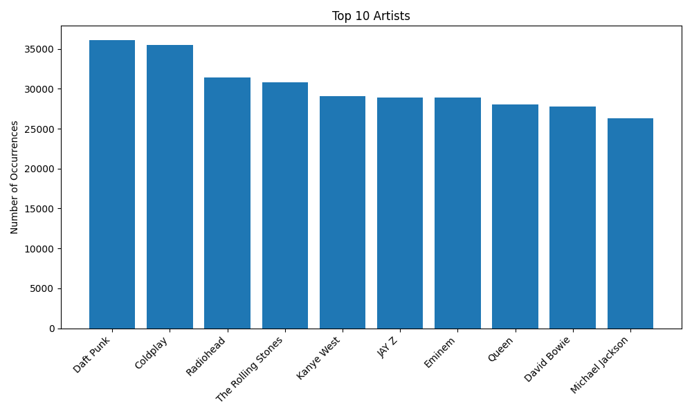
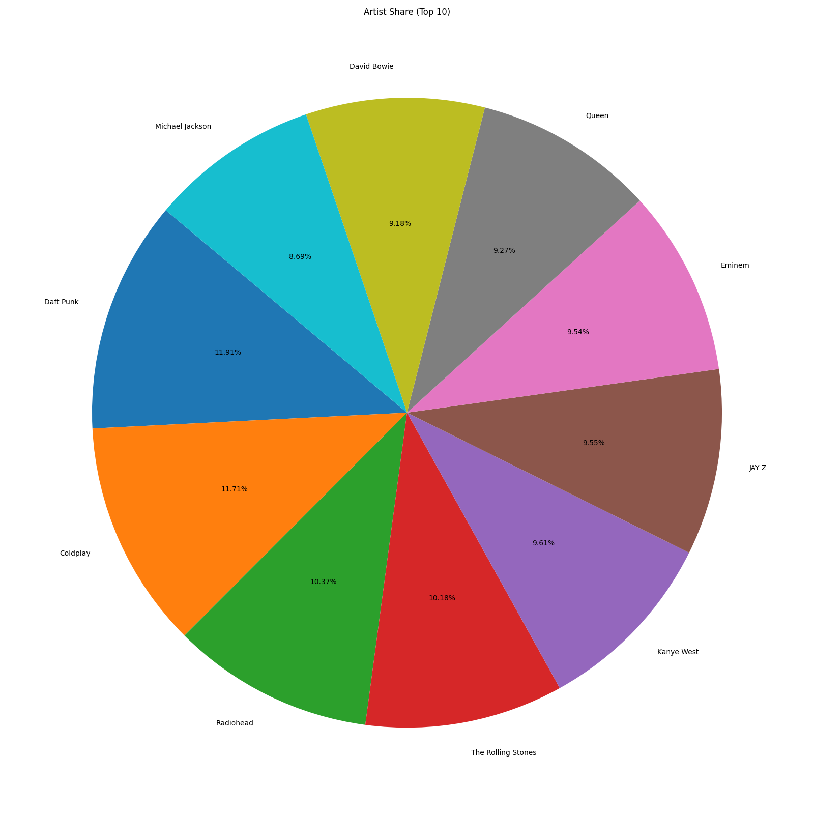
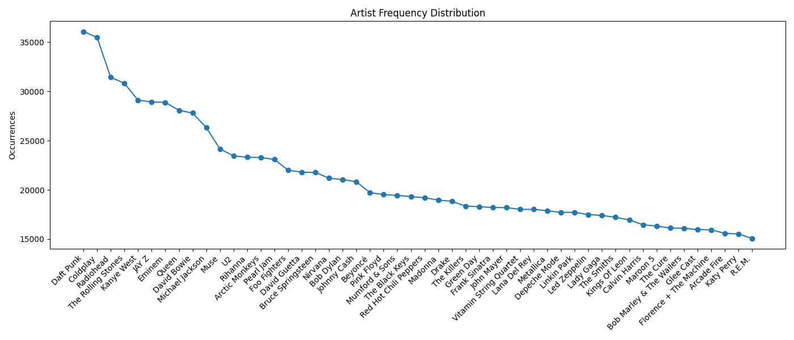

# 🎵 Spotify Playlist Analyzer  
A fully structured data analysis project built using **Pandas**, **NumPy**, and **Matplotlib**.  
This project analyzes a massive Spotify playlist dataset containing over **12.8 million tracks**, identifies top artists, measures playlist diversity, and generates visual insights — all automated through a clean Python pipeline.

---

## 📌 Project Overview  

This project explores and analyzes a large-scale Spotify playlist dataset to uncover patterns such as:

- Most frequently appearing artists  
- Playlist structure  
- Artist diversity  
- Track distribution  
- Visual summaries  
- Text-based reports  

The project follows a modular, production-ready architecture with a combination of scripts and a Jupyter Notebook for exploration.

---

## ⚙️ Features  

✔ Handles **12.8 million rows** efficiently  
✔ Uses category encoding to speed up string operations  
✔ Automated analysis pipeline  
✔ Auto-generated bar charts, pie charts, and distribution plots  
✔ Summary report exported to `outputs/reports/`  
✔ Fully documented Jupyter Notebook  
✔ Professional file structure  
✔ Easy to extend and modify  

---

## 🧹 Data Cleaning  

The dataset underwent multiple cleaning steps:

- Fixing messy column names  
- Removing quotes / extra whitespace  
- Dropping missing artist/track names  
- Removing duplicates  
- Optimizing columns with categorical encoding  

This allows the project to run smoothly even on huge datasets.

---

## 📊 Key Insights

### 🔟 Top 10 Most Frequent Artists
Daft Punk — 36,086

Coldplay — 35,485

Radiohead — 31,429

The Rolling Stones — 30,832

Kanye West — 29,111

JAY Z — 28,928

Eminem — 28,894

Queen — 28,079

David Bowie — 27,802

Michael Jackson — 26,336

The diversity is low due to heavy repetition of popular artists across playlists.

---

## 🖼️ Sample Visualizations

### **Top 10 Artists Bar Chart**

### **Artist Share Pie Chart**

### **Artist Distribution Plot**

---

## 📒 Jupyter Notebook

The full exploration process — including raw data inspection, cleaning, optimization, and visual analysis — is documented in: 
notebooks/exploration.ipynb

This notebook is perfect for readers who want to understand the workflow step-by-step.

---

## 🚀 Running the Project

### **1. Install dependencies**

### **2. Run the full pipeline**
python main.py

This will:
- Load & clean the data  
- Analyze top artists  
- Generate graphs  
- Save a summary report  

Outputs appear in:
outputs/charts/
outputs/reports/

---

## 🛠️ Tech Stack  

- Python  
- Pandas  
- NumPy  
- Matplotlib  

---

## 💬 Feedback / Contributions  
Feel free to fork this repo, submit issues, or suggest improvements!  

